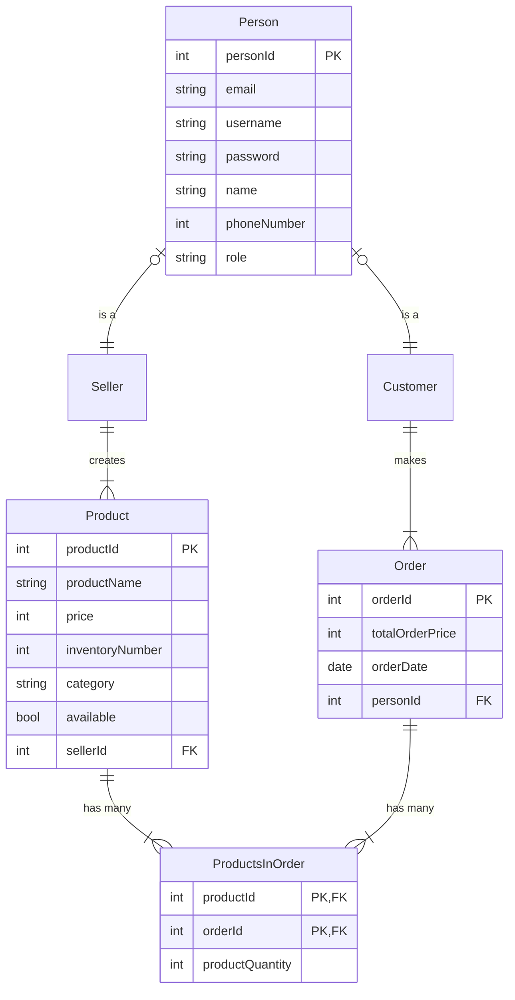
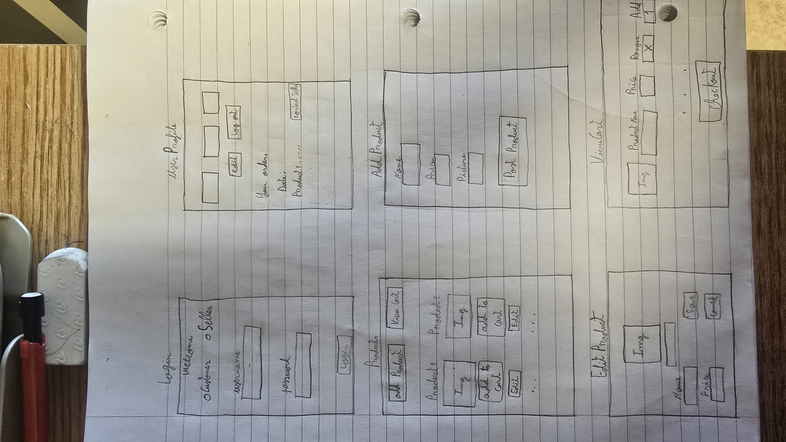
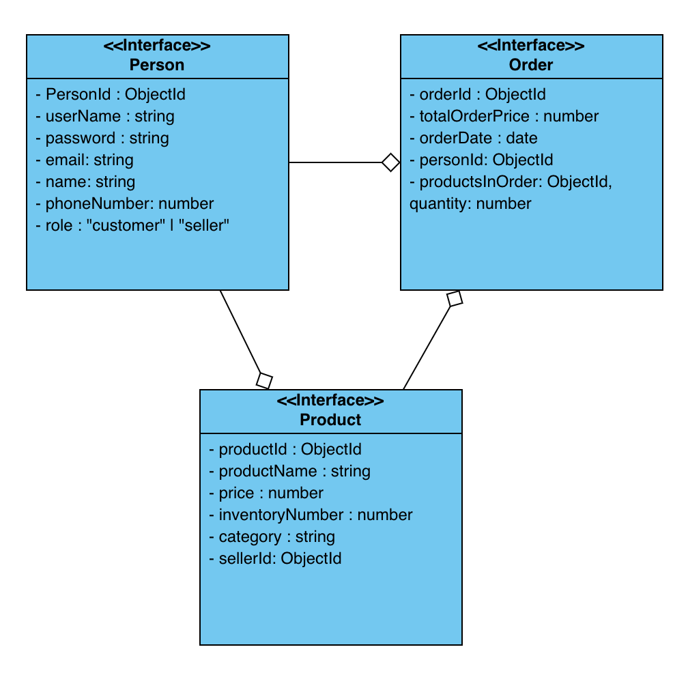

---
An online shopping app, this app is made for everyone to shop for products. The problem this app solves is that when someone wants to buy something, they will be able to buy it and place an order. It provides an easy and user-friendly way of showing products and making purchases easy.

## 🧱 Core Functionality

*	**Order Creation**: Customers can create new orders by adding products to their cart.
*	**User Management**: Users can log in and out seamlessly.
*	**Order Management**: Within an order, customers can:
	*	Create new orders with products
 	*	View the orders
 	*	Delete an order before purchasing
 	*	Edit the amount of a product in an order before purchasing
* **Product Management**: sellers can:
 	* Create new products to sell to users
 	* Edit product information
 	* Delete a product
 	* Mark a product as unavailable

### Requirements

### Customer Stories

* As a customer, I want to be able to create an order, which can contain 1 or many products, so that I can buy what I want.

*	As a customer, I want to view all my orders so that I can see what I bought.

* 	As a customer, I want to sort my orders by date by default, so that I know when I ordered my products.

*	As a customer, I want to view products in a list so that I can buy them.

*	As a customer, I want to sort the products by name (by default) or price, so that I can see products by lowest price

*	As a customer I want to delete a product in my order before purchasing so that I can have flexibility changing my order.

*	As a customer I want to edit the amount of the product I want in my order so that I can change the quantity of the product I want to order.

*	As a customer, I want to see the seller’s profile of a given product, so that I can contact them

### User Stories

*	As a user, I want to register for an account so that I can start ordering products.

*	As a user, I want to log in to my account so that I can access my orders.

*	As a user, I want to log out of my account so that I can end my session.

*	As a user, I want to update my personal information such as my email so that I get my orders invoices on a new email

*	As a user, I want to delete my account so that I can delete all my products (if I am a seller) or delete all my orders (if I am a customer)

### Seller Stories

*	As a seller, I want to create one or multiple products, so that I can sell them to my users

*	As a seller, I want to view my products so that I can see what products I have created.

*	As a seller, I want to delete a product that I sell so that I can manage my inventory.

*	As a seller, I want to see one of my single products, so that I can edit it if necessary.

*	As a seller, I want to edit my products so that I can update its inventory or details.

*	As a seller, I want to mark a product as unavailable/out of stock, so that I can restock my products as necessary

## ᛦ Entity Relationships

>[!note]
> If you view the source code for this README file, you'll see the Mermaid syntax that generated the following diagram. You can copy the code into the [live Mermaid editor](https://mermaid.live) to play around and make changes specific to your app.

## 📍 API Routes

### Order Management:
| Request | Action | Response | Description |
|---------|--------|----------|-------------|
| GET /orders | OrderController::getOrders | 200 UserProfileView | Retrieve details of the current user’s orders. |
| GET /cart | OrderController::getCart | 200 ViewCart | Get all products inside the cart. |
| POST /cart/:product-id | OrderController::addCartProduct | 201 /cart/:product-id | Add a product to the cart. |
| PUT /cart/:product-id | OrderController::updateCartProduct | 200 /cart/:product-id | Edit a product in the cart (usually amount of the product). |
| DELETE /cart/:product-id | OrderController::deleteCartProduct | 204 /cart | Delete a product from the cart. |

### Product Management:
| Request | Action | Response | Description |
|---------|--------|----------|-------------|
| POST /products | ProductController::createProduct | 201 /products | Create a product. |
| PUT /products/:product-id | ProductController::updateProduct | 200 /products/:product-id | Update a single product. |
| DELETE /products/:product-id | ProductController::deleteProduct | 204 /products | Delete a single product. |
| GET /products | ProductController::getAllProducts | 200 ProductsView | Show all products. |
| GET /products/:product-id | ProductController::getOneProduct | 200 ProductsView | Show a single product. |
| GET /products?sort=price | ProductController::getAllProducts | 200 ProductsView | Show all products sorted by price. |
| GET /products?sort=seller-name | ProductController::getAllProducts | 200 ProductsView | Show all products sorted by price. |
| PUT /products/:product-id/unavailable | ProductController::markUnavailable | 200 /products/:product-id/unavailable | Mark a product as unavailable. |

			
### Log In:
| Request | Action | Response | Description |
|---------|--------|----------|-------------|
| POST /person | PersonController::createPerson | 201 /person | Create a user. |
| POST /login | PersonController::logIn | 201 /login | Logging in. |
| POST /logout | PersonController::logOut | 201 /logout | Logging out. |
| GET /person | PersonController::getPerson | 200 UserProfileView | Get a user profile. |
| PUT /person | PersonController::updatePerson | 200 /person | Edit a user profile |
| DELETE /person | PersonController::deletePerson | 204 /login | Delete a user profile |

## 📐 Wireframes

## UML

## Test Cases

### Model
* Inserting into a Person, Product and Order
* Getting one Person, product
* Getting all Products, Orders
* Updating Person information, updating product
* Deleting a person -> Deleting all products associated to seller,
* deleting all orders associated to customer
* Delete a product
* Mark product as unavailable

### HTTP
* GET all products in cart
* POST a product to cart
* PUT a product quantity to cart
* DELETE a product from cart
* GET all products, sorting products by seller name, product price
* POST Log in, log out
* POST into a Person, Product and Order
* GET one Person
* GET one Product
* GET all Orders
* PUT Person information, PUT product
* DELETE a person -> Deleting all products associated to seller,
* DELETE all orders associated to customer
* DELETE a product
* PUT Mark product as unavailable
